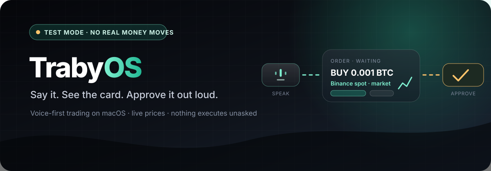

  

  <a href="https://trabyos-website.vercel.app/"><strong>Website</strong></a> ·
  <a href="https://github.com/TrabyOS/trabyos-test"><strong>Try the test build</strong></a> ·
  <a href="https://github.com/TrabyOS/trabyos-test/releases/latest"><strong>Download</strong></a>

## Trading you can do by talking, and stop by not answering

TrabyOS is a **macOS-native, voice-first AI trading workspace**. Hold push-to-talk, say what you want in
plain language, and release. The request is transcribed, interpreted, resolved against live public market
data, and shown as a card anchored at the top of your screen — the TrabyOS island.

Nothing is sent to an exchange at that point. The card waits. It becomes an order only when you approve it
out loud, or cancel it the same way. **Silence is not consent:** an unanswered card does not execute.

> A free test build is available for Apple Silicon Macs. It uses live Binance prices against a simulated
> exchange — no exchange account is connected and no real order can be placed.

## What a session looks like

| You say | You get |
| --- | --- |
| "Show me the Bitcoin chart." | A live price card with a candle chart |
| "What's my balance?" | Your account summary |
| "Buy 0.001 Bitcoin on Binance spot at the market." | An order card, waiting |
| "Approve." | The order is placed and filled |
| "Open a 5x long on 0.001 Bitcoin." → "Approve." | A perpetual position |
| "Close my Bitcoin long." → "Approve." | Closed, with realized P&L |
| "Any news on Bitcoin?" | A headlines card |

An order card also accepts ordinary phrasing — "Yes, go ahead and place it.", "Confirm.", "No, cancel
that." You are answering a question, not reciting a command.

## Why a voice interface needs stricter rules, not looser ones

Speech is ambiguous and a trading action is not reversible, so the product is built around a few
non-negotiable boundaries:

- **Instruments resolve deterministically.** Which market a spoken phrase refers to is decided against a
  live public catalog, not guessed by a language model.
- **Every mutation needs a deliberate, non-reusable confirmation.** Approving one card never carries over
  to the next.
- **A waiting card can be corrected before it is approved** — say the revised amount and the card updates
  and re-arms, rather than executing something you no longer meant.
- **Checks run before an order leaves.** Notional minimums, leverage limits, and available balance are
  verified deterministically.
- **The transcript is kept as evidence.** What was said, and what was approved, stays auditable.
- **Real-money execution is fail-closed** and disabled in the distributed test build.

## The test build

Voice trading on your Mac in test mode. Every launch starts a fresh test account, so you can practice an
order, a leveraged position, and a close without risking anything.

| | |
| --- | --- |
| Platform | Apple Silicon Mac (M1 or later), macOS 13 or later |
| Space | About 3 GB free |
| Push-to-talk | Hold `Fn` + `Control`, speak in English, release |
| Permissions | Microphone, and Accessibility for global push-to-talk |
| Money at risk | None — simulated exchange, no exchange account connected |

Speech is transcribed by OpenAI. If the bundled key stops working the app asks for your own OpenAI API
key and keeps it on your Mac.

**[Download TrabyOS Test →](https://github.com/TrabyOS/trabyos-test/releases/latest)**

## Stack

| Area | Technology |
| --- | --- |
| Client | Swift, SwiftUI / AppKit native macOS island |
| Core | Spring Boot, Java |
| Coordinator | Python |
| Market data | Exchange public market APIs |
| Storage | PostgreSQL |

## Repositories

- **[`trabyos-test`](https://github.com/TrabyOS/trabyos-test)** — the public test build, its release
  notes, and setup instructions in English and Korean.
- `trabyos` — the product repository. Private.

  <a href="https://github.com/TrabyOS/trabyos-test"><strong>Talk to a Mac about Bitcoin →</strong></a>

